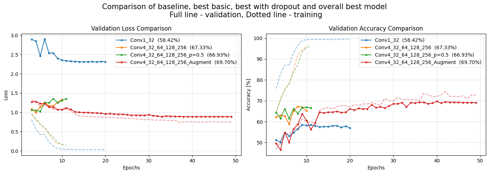
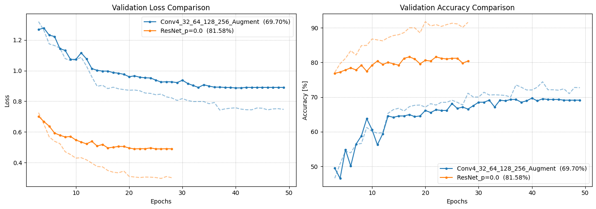
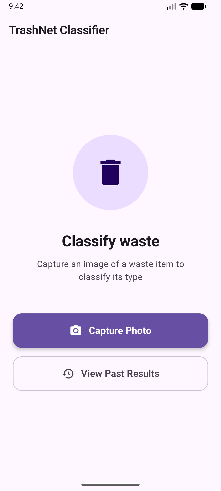
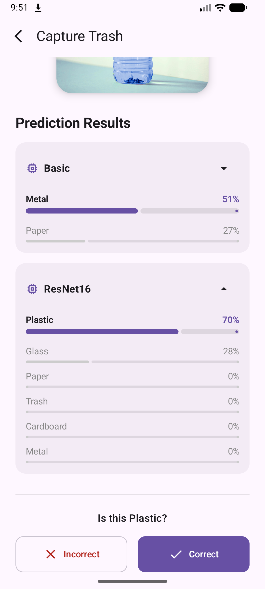
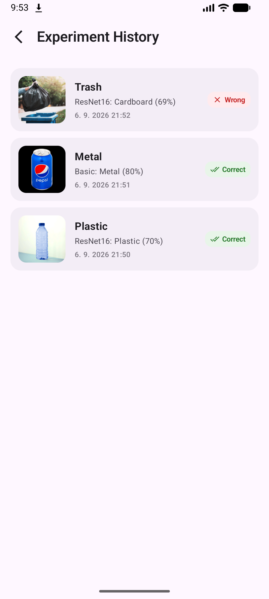

# Trash Classification

A full-stack machine learning project for classifying images of trash into 6 different classes.

The project consists of two image classification models, a FastAPI backend serving the models, 
and an Android application used to interact with the API deployed to Google Cloud.

## Overview

The project covers:

* training and evaluating image classification models with PyTorch
* building a CNN from scratch
* using a pretrained ResNet18
* data augmentation, dropout and batch normalization
* serving trained models through a FastAPI API
* containerizing the backend with Docker
* deploying the container to Google Cloud
* building an Android client for interacting with the API
* storing predictions and user-provided ground truth locally

The models classify an image into one of six trash categories.

## Models

Two models were trained and evaluated.

### Custom CNN

A convolutional neural network built from scratch.

The final version uses four convolutional layers together with dropout and data augmentation.

During development, I experimented with different numbers of layers and filters.

#### Comparison of learning curves of multiple custom CNNs


### ResNet18

A pretrained ResNet18 was used as a second approach and compared with the custom CNN.

#### Comparison of learning curves of best custom CNN and ResNet18


Both models return a probability distribution over the six classes.

#### Example response:

```json
{
 "response" : [
        {
            "model_name": "ResNet",
            "result": {
                "Cardboard": 0.141,
                "Glass": 0.54,
                 ...
            }
        },
        {
            "model_name" : "Basic",
            "result" : {
                "Cardboard" : 0.41,
                "Glass" : 0.24,
                 ...
            }
        }
    ]
}
```

## Backend

The backend is implemented using **FastAPI**. The main endpoint is:

```text
POST /predict
```

It accepts an image and runs inference using both trained models.

The API returns the predicted class probabilities for each model, allowing the Android application to display and compare their predictions.

## Docker

The backend and trained models are packaged into a Docker container.

The container includes:

* the FastAPI application
* Python dependencies
* PyTorch
* the trained model files

A `Dockerfile` is used to build the image and `.dockerignore` keeps unnecessary files out of the build context.

## Google Cloud

The Docker container is deployed to Google Cloud, making the API accessible remotely. 

The Android application communicates with the deployed API rather than running the models directly on the device.
## Android Application
| Home Screen                     | Capture Screen                        | History Screen                        |
|---------------------------------|---------------------------------------|---------------------------------------|
|  |  |  |

The Android application provides a simple interface for interacting with the models.

### Home

The main entry point of the application.

### Capture

The user can either:

* take a photo using the camera
* select an existing image from the gallery

The selected image is sent to the FastAPI backend for classification.

After receiving the response, the application displays the predictions from both models.

The user can also provide the ground truth class of the object. This is currently used only by the Android application and is not sent back to the backend.

### History

Previous classification attempts are stored locally on the device.

Each entry contains:

* the image
* predictions from both models
* the user-provided real class

These entries can then be viewed in the history screen.

## Technologies
**Machine Learning**: Python, PyTorch, torchvision\
**Backend**: FastAPI, Uvicorn\
**Cloud**: Docker, Google Cloud\
**Android**: Kotlin, Jetpack Compose
